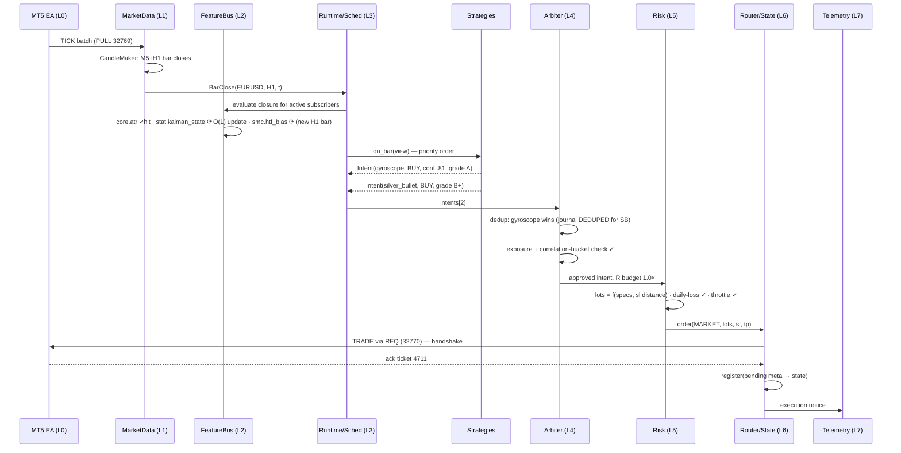
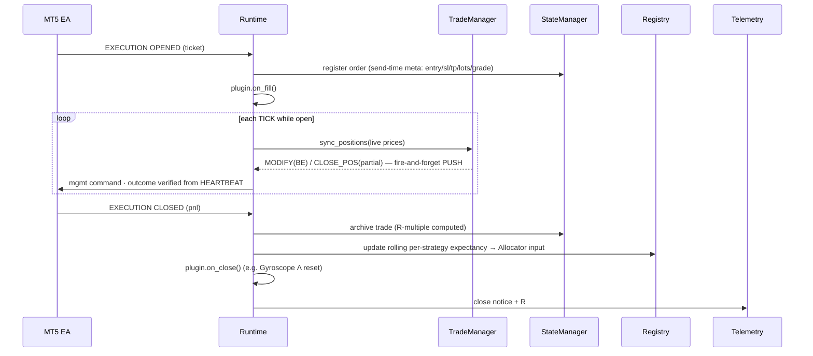

# Titan Trading OS — Unified Strategy Execution Platform Blueprint

**Date:** 2026-07-12
**Status:** Architecture blueprint (Phase II of the novel-arsenal research session; no code yet)
**Companion:** `2026-07-12-novel-arsenal-brainstorm.md` (Phase I — the strategies this platform must host)

---

## 0. Design stance and honest calibration

Titan today is a single asyncio process trading ~9 symbols at M5/H1 bar cadence through one
broker bridge. The strategies from Phase I (Gyroscope, Aftershock, Rubicon, …) all decide on
closed bars in microseconds. This blueprint therefore delivers the **shape** of an operating
system — layers, dependency graphs, registry, plugins, arbitration, shared risk — with
implementations sized to reality, plus an explicit growth path.

Two calibration principles govern everything below:

1. **Bar-close is the clock tick.** In a bar-driven system, cache invalidation is not a hard
   problem — a bar-derived value is valid *exactly until the next bar closes*. The entire
   "adaptive decay" requirement collapses into each resource declaring **what event invalidates
   it** (bar close, session transition, calendar refresh, never). This gives deterministic
   caching with none of the TTL-guessing machinery.
2. **Compute is not the scaling limit; correlation is.** A hundred strategies sharing 60
   features on 9 symbols is trivial compute (§12 shows the arithmetic). The real limit on
   an ever-growing arsenal is *statistical* — many strategies making the same macro bet.
   That is why the Arbiter/Allocator (§9) is a first-class layer, not an afterthought.

**Explicitly rejected at current scale** (recorded so future-us knows they were considered,
not missed — each has a cheap substitute that preserves the property the fancy version buys):

| Rejected mechanism | Why | Cheap substitute |
|---|---|---|
| Predictive prefetching | Bar-driven flow means we know *exactly* what's needed at each close; there is nothing to predict | Compute-on-close via the dependency DAG |
| Hot/warm/cold RAM tiers | Live working set is a few MB of DataFrames | Two tiers: in-process dicts (hot) + disk (persistent/cold), §11 |
| Time slicing / CPU balancing | Full bar cycle for all strategies is <50 ms on one core | Per-strategy wall-clock budget with auto-suspend (§8.4) |
| Multi-process live loop | Destroys determinism and state simplicity for zero need | Process pool reserved for research/backtests only |
| Distributed cache versioning | Single process, single writer | Monotonic bar-time keys are the version |

---

## 1. Layered architecture (Deliverable 1)

```
┌────────────────────────────────────────────────────────────────────────┐
│ L7  OPS & OBSERVABILITY   telemetry (Telegram), cockpit (FastAPI/WS),  │
│                           metrics registry, journals                  │
├────────────────────────────────────────────────────────────────────────┤
│ L6  EXECUTION             OrderRouter (ZMQ REQ entry / PUSH mgmt),    │
│                           TradeManager (BE/partials/ratchet),         │
│                           StateManager (SQLite WAL), reconciliation   │
├────────────────────────────────────────────────────────────────────────┤
│ L5  RISK ENGINE           sizing, exposure & correlation caps,        │
│                           drawdown throttle, kill switches            │
├────────────────────────────────────────────────────────────────────────┤
│ L4  ARBITER & ALLOCATOR   intent collection, dedup, conflict rules,   │
│                           capital allocation, regime weights          │
├────────────────────────────────────────────────────────────────────────┤
│ L3  STRATEGY RUNTIME      registry, plugin lifecycle FSM, scheduler,  │
│                           ResourceView sandboxing, budget guard       │
├────────────────────────────────────────────────────────────────────────┤
│ L2  FEATUREBUS            universal + group resource pools as one     │
│     (resource pool+cache) dependency DAG, memoized per event key      │
├────────────────────────────────────────────────────────────────────────┤
│ L1  MARKET DATA ENGINE    tick ingestion, CandleMaker, MTF store,     │
│                           TimeEngine, sessions, calendar/news, specs  │
├────────────────────────────────────────────────────────────────────────┤
│ L0  BRIDGE I/O            ZMQ sockets (live), HTTP bridge (data),     │
│                           heartbeat watchdog                          │
└────────────────────────────────────────────────────────────────────────┘
```

Data flows strictly upward L0→L3, decisions flow strictly downward L3→L6 through L4/L5.
No layer skips: a strategy cannot touch the bridge; the arbiter cannot compute features.
Strategies see **only** L2 (through a granted view) and emit **only** intents.

Mapping to existing code (what survives, what changes):

| Layer | Today | Becomes |
|---|---|---|
| L0 | `bridge_zmq.py`, `broker/` | unchanged |
| L1 | `MultiTimeframeStore`, `CandleMaker`, `TimeEngine`, `news_manager` | unchanged + emits typed `BarClose`/`SessionChange` events |
| L2 | `SMCAnalyzer`/`BiasEngine` recomputed inline per close in `_run_strategies` | **FeatureBus** (new) — the core refactor |
| L3 | hardcoded list in `_init_strategies` | **Registry + plugin manifests** (new) |
| L4 | none (each signal executes independently; only bias filter + grade floor) | **Intent Arbiter** (new) |
| L5 | `RiskManager` (sizing, equity track) | extended: exposure/correlation/daily-loss/throttle |
| L6 | `_execute_signal`, `trade_manager`, `state_manager` | unchanged |
| L7 | `telemetry`, planned Phase-1 cockpit | + metrics registry fed by all layers |

---

## 2. Layer 1 — Market Data Engine

Single source of market truth. Already 80% built; the blueprint formalizes its outputs as
**typed events** instead of inline calls:

- `Tick(symbol, bid, ask, t)` — updates live price, feeds CandleMaker and TradeManager sync.
- `BarClose(symbol, tf, bar_time, df_ref)` — **the canonical clock tick** of the whole OS.
  Emitted once per (symbol, tf) close; everything downstream keys off `(symbol, tf, bar_time)`.
- `SessionChange(session, state)` — from TimeEngine (Asia/London/NY open-close boundaries).
- `CalendarUpdate(events)` — news manager refresh (scheduled).
- `SpecsUpdate(symbol, tick_value, tick_size, vol_min, vol_step)` — persistent symbol metadata
  (also cached to `data/specs.json` so a restart never trades spec-less).
- `AccountUpdate(balance, equity, positions, orders)` — from HEARTBEAT.

Time authority: TimeEngine is the *only* component allowed to answer "what time is it / what
session is it"; strategies receive session state as a resource, never compute it.

Determinism rule: events for one symbol are processed in arrival order on the single loop;
`BarClose` handlers always run to completion (features → strategies → arbiter → risk →
router) before the next message is drained. One bar cycle is atomic.

---

## 3. Layer 2 — FeatureBus: universal + group resource pools (Deliverables 2, 3, 5)

One mechanism serves both the Universal Resource Pool and every Strategy Group Pool: a
**registry of named Resources forming a dependency DAG, memoized per invalidation key.**
Group pools are just namespaced resource *packages*, loaded lazily when a subscriber exists —
they are libraries of definitions, not separate infrastructures.

### 3.1 Resource definition

```python
@dataclass(frozen=True)
class ResourceSpec:
    name: str                    # "core.atr", "stat.bocpd_posterior", "smc.enriched_df"
    deps: tuple[str, ...]        # names of upstream resources
    scope: Scope                 # PER_SYMBOL_TF | PER_SYMBOL | GLOBAL
    invalidate_on: Trigger       # BAR_CLOSE | HTF_BAR_CLOSE | SESSION_CHANGE
                                 # | SCHEDULE(cron) | PERSISTENT
    compute: Callable[[ResourceCtx], Any]   # pure function of deps + L1 data
    cost_hint: CostHint          # CHEAP | MODERATE | HEAVY  (drives metrics + budgets)
    max_bytes_hint: int          # memory accounting
```

`compute` must be **pure** (deps + L1 windows in, value out). Purity is what makes
memoization safe, backtest/live parity exact, and incremental updates (§4) possible.

### 3.2 Universal pool (`core.*`) — the spec's Layer 2 list, concretely

| Resource | Scope | Invalidate | Notes |
|---|---|---|---|
| `core.ohlc[tf]` | symbol/tf | BAR_CLOSE | view into MultiTimeframeStore (zero copy) |
| `core.atr[tf]`, `core.realized_vol[tf]` | symbol/tf | BAR_CLOSE | incremental (Wilder/EWMA) |
| `core.spread_stats` | symbol | BAR_CLOSE(M5) | rolling mean/percentiles, session-bucketed |
| `core.tick_density`, `core.velocity`, `core.acceleration` | symbol | BAR_CLOSE(M5) | from tick counts + bar deltas |
| `core.session_state` | GLOBAL | SESSION_CHANGE | from TimeEngine |
| `core.calendar_status` | GLOBAL | SCHEDULE | news windows (existing news_manager) |
| `core.symbol_specs` | symbol | PERSISTENT | broker specs |
| `core.trend_stats[tf]` | symbol/tf | BAR_CLOSE | slope, efficiency ratio |
| `core.corr_matrix` | GLOBAL | BAR_CLOSE(H1) | 9×9 rolling return correlation |
| `core.norm_price[tf]` | symbol/tf | BAR_CLOSE | ATR-normalized log price |

### 3.3 Group pools (loaded only if subscribed)

- **`smc.*`** (legacy family — SilverBullet/Unicorn/CRT): `smc.enriched_df[tf]`
  (today's `SMCAnalyzer.process()`), `smc.htf_bias` (today's `BiasEngine`), `smc.liquidity`.
  *Immediate dedup win:* `smc.htf_bias` currently recomputes the full H1 analysis on **every
  M5 close of every symbol**; as a resource it recomputes once per H1 bar — a ~12× cut in
  the single heaviest call, for free, with identical semantics.
- **`stat.*`** (Gyroscope/Rubicon/Spring/Trinity): `stat.zscore[col]`,
  `stat.kalman_state` (level/velocity/covariance — Gyroscope's filter, also usable by others),
  `stat.bocpd_posterior` (Rubicon's run-length posterior — doubles as the arsenal-wide regime
  clock), `stat.ou_fit` (θ, μ, half-life), `stat.hmm_posterior` (Trinity).
- **`sigproc.*`**: `sigproc.detrended[tf]`, `sigproc.dominant_cycle` (wavelet/FFT),
  `sigproc.noise_floor`, `sigproc.filtered[spec]`.
- **`physics.*`** (Rainflow/Aftershock): `physics.turning_points`, `physics.rainflow_cycles`,
  `physics.fatigue_index`, `physics.hawkes_intensity`, `physics.event_stream` (large-range events).
- **`net.*`** (Constellation + portfolio brake): `net.leadlag_edges`, `net.centrality`,
  `net.risk_clusters` (correlation buckets consumed by the Risk Engine — a group pool
  feeding L5, the one sanctioned cross-layer output).
- **`mi.*`** (graders/anomaly): `mi.feature_vector` (shared bar-shape features),
  `mi.anomaly_score` (Antibody), `mi.signal_grade_ctx` (inputs the SignalGrader reuses).

New scientific family ⇒ new package file registering resources; **zero kernel changes**.

### 3.4 Dependency graph & evaluation

Registration builds a static DAG (cycle-checked at boot — fail fast, not at 3 a.m.). On
`BarClose(sym, tf, t)` the runtime takes the union of resources required by *active,
subscribed* strategies for that (sym, tf), topologically orders the closure, and evaluates
each node once: cache hit if the node's invalidation key is unchanged, else compute and store.
Unsubscribed resources are never evaluated — idle group pools cost zero CPU and zero memory
(spec requirement honored structurally, not by policy).

```
BarClose(EURUSD, H1, t)
  needed = smc.htf_bias ∪ stat.kalman_state ∪ physics.hawkes_intensity ∪ deps…
  order  = core.ohlc → core.atr → core.realized_vol → {stat.kalman_state, physics.event_stream}
           → physics.hawkes_intensity → …
  each node: key = (name, sym, tf|-, t) → hit? return : compute, store, count
```

---

## 4. Layer 2½ — Cache system and decay model (Deliverable 4)

### 4.1 Cache entry

Every FeatureBus value is stored as:

```python
@dataclass
class CacheEntry:
    key: tuple            # (name, symbol, tf|None, invalidation_token)
    value: Any
    created: float; last_access: float; hits: int
    compute_ms: float     # observed cost (feeds metrics + prefetch-at-boot ordering)
    nbytes: int           # measured footprint
    deps_keys: tuple      # exact upstream keys used (provenance / debugging)
    source: str           # registering package
```

### 4.2 Adaptive decay = event-keyed invalidation (the deterministic version)

Each resource's `invalidate_on` **is** its decay function. The invalidation token embedded in
the key changes only when the resource's governing event fires, so "expiry" is exact, not
approximate — and identical in backtest and live:

| Resource class | Token | Effective lifetime |
|---|---|---|
| Tick-derived (`velocity`, `tick_density`) | M5 bar_time | minutes |
| Bar analytics (`atr`, `kalman_state`) | own-tf bar_time | one bar |
| HTF analytics (`htf_bias`, `corr_matrix`) | HTF bar_time | one HTF bar (hours) |
| Session state | session id | until transition |
| Calendar | fetch epoch | scheduled refresh |
| Symbol specs | — | persistent (disk-backed) |

Wall-clock TTLs are deliberately absent from the hot path: they are nondeterministic (a
backtest replaying at 1000× would expire things live wouldn't). The single exception is a
staleness *alarm* (not expiry): if `BarClose` events stop arriving, the watchdog — not the
cache — declares the feed unhealthy (existing heartbeat logic).

### 4.3 Cache manager responsibilities (spec checklist → mechanism)

- **Automatic invalidation** — key rotation on governing events (above).
- **Lazy loading** — nothing computes without a subscriber in the closure.
- **Prefetching** — only at boot/warmup: after history load, evaluate the full DAG once per
  symbol so the first live bar pays cache-hit prices. Steady-state prefetching rejected (§0).
- **Memory pressure** — LRU eviction of *recomputable* entries when Σnbytes > budget
  (default 256 MB); persistent-class entries exempt. Eviction only ever costs a recompute.
- **Dependency tracking** — static DAG + per-entry `deps_keys` provenance.
- **Incremental updates** — resources may keep private running state (Wilder ATR, Kalman P,
  Hawkes decay sum) keyed to last bar_time; on consecutive bars they update O(1) instead of
  recomputing the window. A gap (missed bars) forces full recompute — correctness first.
- **Version control** — package version stamped into keys; bumping a resource's version cold-
  starts exactly that subtree, nothing else.
- **Hot/cold + rehydration** — slow-moving GLOBAL/PERSISTENT resources (corr matrix, specs,
  fitted model params) snapshot to disk on write and rehydrate at boot, so restarts don't
  re-fit models mid-session.
- **Analytics** — per-resource hit/miss/compute_ms/nbytes counters exported to L7 (§10).

---

## 5. Strategy Registry (Deliverable 7, part 1)

A `StrategyManifest` (YAML or dataclass, one per plugin) is the strategy's *contract*:

```yaml
id: gyroscope             # unique, stable
version: 1.0.0
family: statistical       # scientific group → which pool package to load
class: src.strategies.models.gyroscope:GyroscopeStrategy
requires: [core.ohlc, core.atr, core.spread_stats, stat.kalman_state]
optional: [stat.bocpd_posterior]        # degrades gracefully if absent
symbols: [EURUSD, GBPUSD, XAUUSD]       # ∩ config pairs
timeframe: H1                            # BarClose subscription
regimes: [trend, turbulence]            # Trinity gating hint (advisory)
min_grade: B                             # grader floor override (else global)
cost: {cpu: cheap, mem_mb: 1}
priority: 50                             # arbiter tiebreak + execution order (lower first)
status: research                         # research | demo | live  (gates real orders)
```

The registry (singleton, persisted summary in SQLite) resolves manifests at boot from
config, validates: class importable, all `requires` resolvable in the DAG, symbols have
specs paths, version/params hash journaled (so every trade in the journal is attributable
to an exact strategy version — extends the existing grader-journal discipline). Runtime API:
`enable(id)`, `disable(id)`, `suspend(id, reason)`, `reload(id)` — wired to Telegram commands
and the Phase-1 cockpit. `_init_strategies()`'s hardcoded list dies here.

---

## 6. Strategy lifecycle FSM (Deliverable 7, part 2)

```
REGISTERED ─load→ LOADED ─init(params)→ INITIALIZED ─subscribe(granted view)→ SUBSCRIBED
 ─activate→ ACTIVE ⇄ SUSPENDED ─deactivate→ SUBSCRIBED … ─unload→ UNLOADED
                │
                └─ within ACTIVE, per BarClose: MONITOR → (maybe) EMIT INTENT
```

Transitions and who triggers them:

| Transition | Trigger |
|---|---|
| load/init | boot, or hot-add via registry command |
| subscribe | runtime grants a **ResourceView** exposing exactly `requires ∪ optional` — access to an undeclared resource raises; the manifest is enforced, not decorative |
| activate | operator command, `status ≥ demo`, warmup satisfied (per-resource warmup bars) |
| suspend | operator; **budget guard** (§8.4); **self-grade breach** (e.g. Gyroscope's realized false-entry rate > 2α); Antibody ALERT; risk engine global derate |
| reactivate | operator, or auto after self-heal condition (NIS clean for W bars) |
| unload | shutdown or removal; plugin's `teardown()` may persist private state |

Per-strategy performance attribution (R-multiples by strategy, already journaled at close in
`_process_incoming_data`) feeds the EVALUATED loop: the registry keeps rolling per-strategy
expectancy that the Allocator (§9.3) and the operator can act on.

### Plugin contract (the whole of it)

```python
class StrategyPlugin(Protocol):
    manifest: StrategyManifest
    def init(self, params: dict) -> None: ...
    def on_bar(self, view: ResourceView, ctx: BarCtx) -> Intent | None: ...
    def on_fill(self, fill: FillEvent) -> None: ...        # optional
    def on_close(self, closed: CloseEvent) -> None: ...    # optional (e.g. Λ reset)
    def teardown(self) -> None: ...
```

Strategies contain decision logic, entry/exit conditions, their own state machine, and
parameters. **Nothing else** — no data fetching, no indicator math, no sizing, no orders, no
logging plumbing (a scoped logger is injected). The existing `BaseStrategy` children keep
working through a thin adapter (`on_new_candle(enriched_df, ctx)` ⇐ `on_bar(view, ctx)` with
`view["smc.enriched_df"]`), so migration is incremental, not big-bang.

---

## 7. Resource subscription model (Deliverable 5, part 2)

- At `subscribe`, the runtime resolves the strategy's `requires` closure through the DAG and
  registers it as a *subscriber* of each node for its (symbols × timeframe).
- The per-BarClose evaluation set is the union over active subscribers — so **refcounting is
  structural**: disable the last statistical strategy and `stat.*` silently stops computing;
  re-enable and it warms up again. No manual pool management, ever.
- `optional` resources compute only if *some* other subscriber already forces them, else the
  view returns `None` and the strategy must degrade (documented, testable behavior).
- Grant enforcement: `ResourceView.__getitem__` checks the manifest. A strategy touching
  undeclared data is a bug caught in the first backtest, not a hidden coupling discovered
  during an incident.

---

## 8. Execution scheduler (Deliverable 6)

### 8.1 The event loop (determinism by construction)

Single asyncio loop, single writer for all mutable state (today's model, kept deliberately).
The scheduler is a **priority-ordered, run-to-completion pipeline per event**, not a
preemptive kernel:

```
drain bridge batch → for each msg (arrival order):
  TICK        → price update → TradeManager sync (mgmt commands out) → CandleMaker
  BarClose    → [BAR CYCLE — atomic]:
                 1. FeatureBus: evaluate needed closure (topo order)
                 2. Strategies: active ∩ (symbol, tf), ordered by (priority, id)
                    each: view = grant(strategy); intent = on_bar(view, ctx)
                 3. Arbiter: collect intents → resolve (§9)
                 4. Risk: size + gate survivors (§9.4/L5)
                 5. Router: dispatch orders (REQ entry / PUSH mgmt)
  HEARTBEAT   → account/positions reconcile (existing)
  EXECUTION   → state register/archive → plugin on_fill/on_close → telemetry
```

### 8.2 Ordering guarantees

- Within a bar cycle: resources before strategies; strategies in `(priority, id)` order —
  stable, documented, and identical in backtest and live (bit-for-bit replayable given the
  same message tape; purity of `compute` is what makes this true).
- Across symbols: arrival order of `BarClose` events. Multi-symbol strategies
  (Constellation) declare `barrier: [symbols]` in the manifest; the runtime holds their
  invocation until all listed symbols' bars for that timestamp have closed (or a 2-bar
  timeout marks the cycle degraded and skips them — no stale-mix inputs).

### 8.3 Parallelism policy

Live loop: single-threaded forever at this scale (a full 9-symbol H1 cycle with all Phase-I
strategies is well under 50 ms; determinism is worth more than the headroom). The
`ProcessPoolExecutor` exists for *research-class* jobs only: backtests, quarterly HMM/EVT
refits, parameter sweeps — fire-and-forget with results landing as PERSISTENT resources.

### 8.4 Budget guard (the honest "starvation prevention")

Each strategy's `on_bar` is timed. Overrun of its declared budget (default 10 ms) → warning;
3 consecutive overruns → auto-SUSPEND + Telegram alert. A misbehaving plugin can degrade
*itself* but never the bar cycle, the other strategies, or trade management. Same guard on
HEAVY resources (budget 100 ms) with the subscribing strategies suspended on breach —
the OS protects the commons.

---

## 9. Conflict resolution & capital allocation — the Intent Arbiter (Deliverable 8)

Strategies emit **Intents**, not orders:

```python
@dataclass(frozen=True)
class Intent:
    strategy_id: str; symbol: str; direction: Side
    kind: Kind                    # OPEN_MARKET | OPEN_LIMIT | OPEN_STOP | CLOSE | MODIFY
    price: float; sl: float; tp: float
    confidence: float             # strategy-native [0,1] (SPRT margin, λ percentile, …)
    grade: str                    # SignalGrader output (kept — it works)
    thesis_id: str                # idempotency: same thesis re-emitted ≠ new trade
    ttl_bars: int
```

### 9.1 Arbitration pipeline (deterministic, ordered)

1. **Dedup** — same (symbol, direction) from multiple strategies in one cycle: keep highest
   `(grade, confidence, priority)`; losers journaled as `DEDUPED` (visible, not silent).
   `thesis_id` replays are dropped.
2. **Opposition rule** — same symbol, opposing directions in one cycle: configurable policy,
   default `higher-grade-wins-else-both-blocked`. A block is journaled as a *disagreement
   event* — portfolio-level information (two families reading one market oppositely) that
   feeds the metrics, echoing the spec's "strategy consensus."
3. **Position conflict** — intent against an existing opposite position on the symbol:
   default block (no hedging — FBS netting accounts make hedging fictional anyway);
   `CLOSE` intents always pass.
4. **Exposure gates** — per-symbol max concurrent positions (default 1), per-strategy max
   (manifest), portfolio max total open R, **correlation-bucket cap** via `net.risk_clusters`:
   Σ open R within a cluster ≤ cap — nine EUR-legged longs are one bet and get one bet's risk.
5. **Capital allocation** — surviving intents get a risk budget:
   `R = base_R × strategy_weight × regime_weight × grade_mult`, where `strategy_weight` is
   the Allocator's slow variable (§9.3) and `regime_weight` is Trinity's posterior-driven
   multiplier (0–1.25×) when enabled, 1.0 otherwise.

### 9.2 Voting — used for *vetoes*, not entries

Confidence-weighted voting to synthesize entries is rejected: it launders accountability
(whose trade was it?) and correlates failures. Consensus works the veto direction only:
Antibody ALERT, news lockout, Trinity turbulence-onset, and the risk throttle each subtract
multipliers toward zero. Entries stay attributable to exactly one strategy — which is what
keeps per-strategy expectancy statistics meaningful for the Allocator.

### 9.3 Allocator (slow loop, weekly cadence)

Per-strategy rolling net expectancy and drawdown (from the journal) map to
`strategy_weight ∈ [0.25, 1.5]` by a pre-registered, monotone rule (no discretion, no
in-sample cleverness): sustained underperformers bleed allocation before the operator ever
has to decide; a strategy at weight floor for 2 consecutive reviews is flagged for demotion
to `demo`. This is the "performance evaluation → suspended" lifecycle edge, automated.

### 9.4 Handoff to Risk

The Arbiter outputs *approved intents with R budgets*. The Risk Engine (§L5) owns the
translation to lots (existing broker-spec sizing, fail-safe on missing specs), the daily
loss limit, drawdown throttle (halve all R after −2R day, restore after flat/positive day),
and the panic path (existing `/panic` → flatten via PUSH, block ACTIVE). Emergency shutdown
remains reachable from three places: operator (Telegram/cockpit), watchdog, risk engine.

---

## 10. Performance monitoring (Deliverable — monitoring section)

A lightweight in-process `MetricsRegistry` (counters/gauges/histograms; ~100 series total):

| Domain | Series |
|---|---|
| FeatureBus | per-resource hit ratio, computes/hr, compute_ms p50/p99, nbytes, evictions |
| Scheduler | bar-cycle ms p50/p99 per (symbol, tf), budget breaches, degraded cycles |
| Strategies | on_bar ms, intents emitted/deduped/blocked, per-strategy rolling R |
| Arbiter/Risk | conflicts by rule, exposure headroom, throttle state |
| Bridge | queue drain depth, REQ round-trip ms, heartbeat age |
| System | RSS, loop lag (asyncio drift) |

Sinks: 15-min snapshot to SQLite (history), on-demand `/stats` Telegram command, and the
Phase-1 cockpit's WebSocket (this registry **is** the cockpit's data source — the two
designs converge rather than duplicate). Resource-reuse percentage — the spec's headline
metric — is `hits / (hits + computes)` per pool, on the dashboard from day one.

---

## 11. Memory architecture (Deliverable 10)

| Tier | Medium | Contents | Policy |
|---|---|---|---|
| Hot | in-process | live prices, open-position table, current bars, FeatureBus entries invalidating ≤ 1 bar | bounded deques/DataFrames (existing max-length discipline) |
| Warm | in-process, LRU-bounded | FeatureBus entries with HTF/session/schedule keys, fitted model params in use | LRU under 256 MB budget; eviction ⇒ recompute |
| Cold | disk (parquet/CSV + JSONL) | exported history (`data/history/`), signal & trade journals, metrics snapshots, backtest artifacts | append-only; research reads it, live loop never blocks on it |
| Persistent | disk (SQLite WAL + YAML + JSON) | `active_orders`/`trade_history` (existing), registry state, strategy weights, specs cache, rehydratable model snapshots | transactional; survives restart; rehydrated at boot |

RAM "hot vs warm" is an accounting distinction (invalidation class + LRU exemption), not a
physical one — at MB scale, pretending otherwise would be theater. The tiers that matter are
**process vs disk vs transactional disk**, and those are real.

---

## 12. Sequence diagrams (Deliverable 11)

### 12.1 Bar cycle — ingestion → analytics (the main line)



### 12.2 Post-trade — execution → analytics



### 12.3 Cache micro-flow (M5 close, mixed subscribers)

```
BarClose(XAUUSD, M5, 10:05)
 ├─ core.ohlc[M5]        key(…,10:05)  MISS → view (0 copy)          0.0 ms
 ├─ core.atr[M5]         key(…,10:05)  MISS → incremental             0.1 ms
 ├─ smc.enriched_df[M5]  key(…,10:05)  MISS → compute once            3.0 ms  ← shared by 2 SMC strategies
 ├─ smc.htf_bias         key(…,H1@10:00) HIT                          0.0 ms  ← was 2–5 ms × every M5 close
 └─ core.session_state   key(london)   HIT                            0.0 ms
 strategies: unicorn(2 μs) · crt(2 μs)  → no intents → cycle ends     ~3.3 ms
```

---

## 13. Scalability roadmap (Deliverable 12)

### 13.1 Why cost is sublinear in strategy count

Total bar-cycle cost = `O(F_active features) + O(N_strategies × decision)`. Decisions are
microseconds (they read cached values and compare numbers); features dominate — and features
grow with the *number of scientific families* (a handful), not with N. Ten statistical
strategies share one Kalman state, one BOCPD posterior, one z-score table.

Illustrative (measured-class numbers, 9 symbols):

| Arsenal | Features live | Bar-cycle cost | Marginal cost of strategy #N+1 |
|---|---|---|---|
| Today: 4 SMC strategies, no bus | SMC ×every close, bias ×every M5 close | ~40 ms worst case | ~full SMC recompute |
| Kernel v15: same 4 + bus | same set, computed once, bias 12× cheaper | ~8 ms | ~0 if family exists |
| +Phase-I top 3 (7 total) | +stat., +physics packs | ~12 ms | μs (decision only) |
| 30 strategies, 6 families | ~60 resources | ~25 ms | μs |
| 100+ strategies | bounded by families, not N | <100 ms | μs |

The compute story is closed at v15. Beyond ~30 strategies the binding constraints become
(a) **statistical** — correlated intents, handled by the correlation-bucket caps and the
Allocator, and (b) **operational** — attribution and monitoring, handled by the registry +
metrics. That is why those, not compute tricks, got the deep design above.

### 13.2 Staged rollout (each stage shippable, testable, reversible)

- **v15.0 — FeatureBus + SMC package.** Extract `SMCAnalyzer`/`BiasEngine` behind the bus;
  adapter keeps the 4 existing strategies byte-identical in behavior (regression: replay a
  recorded message tape, diff signals). *Win: 12× on the hottest path, and the platform seam
  exists.* ~3–4 days.
- **v15.1 — Registry + manifests + lifecycle.** Kill the hardcoded list; Telegram/cockpit
  enable/disable; per-strategy version journaling. ~2–3 days.
- **v15.2 — Intent Arbiter + Risk extensions.** Intents replace direct `_execute_signal`;
  dedup/opposition/exposure/correlation caps; drawdown throttle. The grader keeps its role
  (grade is an intent field). ~3–4 days.
- **v15.3 — First non-SMC plugin (Gyroscope) + `stat.*` pack.** Proves a new family lands
  with zero kernel edits — the extensibility acceptance test (§14). Gated by its own
  research GO, per the Phase-I blueprint.
- **v16 — Scale-out only if earned:** research process pool as standard equipment; optional
  per-symbol sharding (N processes, symbol-partitioned, same code) *only if* bar-cycle p99
  ever threatens the M5 budget — architecture permits it because state is symbol-partitioned
  already; nothing in the design assumes it.

### 13.3 Backtest/live parity dividend

Because strategies consume only `ResourceView` and resources are pure functions of L1 data,
the backtester becomes: replay bars through the *same* FeatureBus and runtime with a
simulated router. One code path for research and production — the class of bug where the
backtest computes a feature slightly differently from live (a real, recurring risk in the
current inline design) is eliminated structurally. This alone likely repays the refactor.

---

## 14. Extensibility acceptance test (Deliverable — extensibility requirement)

Adding strategy N+1 must consist of exactly:

1. A manifest (YAML block or dataclass).
2. `requires:` naming existing resources — or a new package file registering new ones.
3. A plugin class implementing `on_bar` (+ optional hooks).
4. `registry.enable("new_id")`.

**Definition of done for the kernel:** Gyroscope (v15.3) ships with `git diff --stat` showing
zero changes under `src/core/`, `src/execution/`, or any other strategy. If it can't, the
kernel isn't finished — that test, not this document, is the contract.

---

## 15. Risks and mitigations of the refactor itself

| Risk | Mitigation |
|---|---|
| Behavior drift while extracting SMC path | Golden-tape regression: recorded live message log replayed pre/post; signal streams must be identical before v15.0 merges |
| Big-bang temptation | Stages are independently shippable; live trading continues on each intermediate version |
| Over-abstraction (resources nobody shares) | A resource needs ≥2 subscribers *or* a HEAVY cost to justify existence; else it stays private strategy state — reviewed at each stage |
| Determinism regressions | Purity rule enforced by convention + a replay test in CI (`unittest`, per repo standard) |
| The OS becoming the project | Hard rule: kernel work only between research cycles; strategy gates (Phase I) remain the priority queue |
