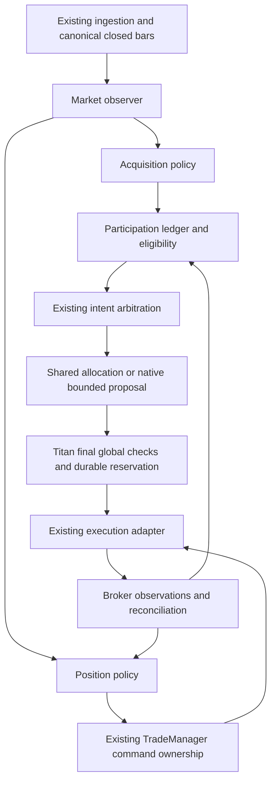

# F–L. Proposed architecture and formal contracts

Everything below is a design proposal for approval and falsification. It is not current Titan behavior. Defaults illustrated here are candidate preregistration values, not calibrated recommendations or an implementation GO.

## F. Three policies inside Titan



The three substantive policies are **market observation**, **acquisition/position decisions**, and **allocation**. AE and VPLE are two pure functions within the second policy; TSE is the first; VARE is the optional third. VCM becomes a small participation/state reducer, not an independent service. Broker commands, database transactions, concurrency and global safety remain Titan responsibilities.

Proposed code boundaries after approval:

- `src/strategies/models/vanguard.py`: BaseStrategy adapter and manifest identity only.
- A small strategy-local VANGUARD package for immutable observations, acquisition/lifecycle reducers and state contracts. Move a primitive to `src/analysis` only when genuinely shared. Avoid five speculative global analysis engines.
- Existing FeatureBus: cache canonical observations by `(symbol, closed_at, data_revision, model_hash)` after routing supports the required horizons.
- Existing `src/risk`: explicit currency-budget sizing seam and reservation-inclusive global checks. Strategy native policy returns a budget ceiling, never arbitrary lots.
- Existing TradeManager: management profile dispatch before legacy TP-dependent logic; preserve its confirmed-target reconciliation pattern. No second manager sends SL modifications.
- Existing StateManager: versioned strategy state, order identity and risk reservation records, with transactional outbox/reconciliation extension if approved. No separate risk DB.
- Existing research replay: inject event clock and execution adapter; use the same pure reducers and policy functions as live. This is an extension, not a second simulator with independent strategy rules.

## Market measurements and conceptual correlation

Let `x_t=log(C_t)`, `r_t=x_t-x_(t-1)` on complete, contiguous bars. For span `n`, use one direction statistic:

`z_n(t) = (x_t-x_(t-n)) / (sqrt(n) * max(sd(r_(t-n+1):r_t), sigma_floor))`.

This is a scale normalization, **not a normal-distribution z-test or probability**. `sigma_floor` derives from tick resolution and price plus the declared numerical floor; it is not optimized by instrument. Flat/invalid data produce unavailable evidence, not infinite confidence. ATR is separately calculated for stop geometry and costs. Using data through close `t` is valid only for a decision submitted after that close.

A normalized OLS slope competitor uses `beta*n/(sigma*sqrt(n))`; raw price slope divided by return volatility is dimensionally inconsistent. Select momentum or slope, never both in the initial model.

Optional efficiency: `ER=abs(sum(r))/sum(abs(r))`, undefined flat paths marked unavailable. It shares the displacement numerator with momentum and therefore is not orthogonal by construction. Compare rank correlations and conditional incremental outcomes in development data; high correlation alone does not prove redundancy, but adding a feature must improve a prespecified held-out prediction/decision. Keep sign fraction, acceleration, entropy and age out of the initial decision rule.

| Quantity | Main information | Likely duplication | Initial use |
|---|---|---|---|
| Normalized momentum/slope | Direction and displacement relative to noise | Velocity, strength | One chosen direction input |
| ATR/realized volatility | Price/risk scale | Instability/volatility scores | Stop/cost normalization |
| Efficiency | Path shape conditional on displacement | Path quality, persistence | Separate ablation only |
| Two horizon readings | Local versus slower displacement | Coherence score | Explicit signed conditions |
| Age/count | Elapsed participation history | Maturity/exhaustion stories | Telemetry only |
| Spread/spec age/bar quality | Executability/information quality | Not trend confidence | Operational veto |

## Horizons

Do not confuse base sampling with economic span. Twenty-four H1 bars and 96 M15 bars can represent similar elapsed history with different sampling noise. Prespecify spans in both elapsed time and completed bars; market closures/gaps must have declared treatment.

Start with a single slow H1 model, then compare two fixed stacks: H1/M15/M5 and H4/H1/M15, with economically comparable span/cost reporting. A stack is one model choice in the trial ledger. M30/M10/M2 is deferred because M2 cannot be recovered from M5 OHLC. Event/volatility clocks and continuous multiscale weights are later alternatives only if fixed stacks fail for an identified, testable reason. Do not expand the search merely because the first result disappoints.

## G. Trend state and identity

Use `INACTIVE`, `ACTIVE`, `UNCERTAIN`, `ENDED`; direction is −1 or +1 when an episode exists. ENDED is a terminal event/archive for that identity; the current observer subsequently becomes INACTIVE or starts a new identity. Missing data is an orthogonal quality condition, not inferred trend decay.

Candidate transition rule, symmetric by direction `d`:

| From | Guard at complete structural close | To / action |
|---|---|---|
| INACTIVE | `z >= a` for `k` consecutive valid closes, or `z <= -a` for `k` | ACTIVE with direction and new ID |
| ACTIVE | `d*z <= 0` | UNCERTAIN; no new entries |
| ACTIVE | Otherwise | ACTIVE; preserve ID |
| UNCERTAIN | `d*z >= a` for `k` closes | ACTIVE; preserve ID |
| UNCERTAIN | `d*z <= -a` for `k` closes | ENDED; invalidate participation, then eligible opposite ID |
| UNCERTAIN | `n` consecutive valid structural observations without recovery | ENDED due to uncertainty expiry |
| Any live state | Missing/stale/out-of-order data | Freeze market inference, mark unavailable, block acquisition; protection continues |

Candidate fixed values: `n=24`, `a=0.5`, `k=2`. These are explicit design choices and count as research degrees of freedom even when frozen. `n` also derives the uncertainty expiry and maximum warmup requirement; do not add independent maturity and decay periods. An opposite confirmation both ends the old identity and may start a new one at the same observed close, in that order. Trading the opposite direction waits for old exposure/pending entries to reconcile away.

`trend_id = hash(strategy_lineage, broker_symbol, direction, activation_event_id, model_config_hash)`.

Use a canonical stable cryptographic digest, not Python's randomized `hash()` or a wall-clock UUID. The activation timestamp is when confirmation becomes observable, never retrospectively the first favorable bar. A pullback inside ACTIVE/UNCERTAIN preserves the ID. Data outage does not manufacture a new trend or reset attempts. On resumption, replay the missing causal bars for state only; do not backfill executable historical orders.

Startup requires a verified snapshot plus suffix replay, or a declared epoch with full required warmup and new-entry lock until reconciliation. A rolling window restart must not quietly invent a new identity for an existing broker position.

## Campaign semantics and FSM

A Trend is a detected market episode. A Campaign is one continuous participation interval in that episode. A Trade is one acquisition with immutable initial risk and lifecycle history. Campaigns are accounting constructs, not evidence of profitable market structure.

`campaign_id = hash(trend_id, persisted_attempt_ordinal)`; `trade_id = hash(campaign_id, acquisition_event_id, entry_family, policy_version)`.

| Campaign state | Entry condition / transition | New exposure |
|---|---|---|
| OPENING | Durable reservation/entry intent exists, no confirmed filled quantity yet | No second acquisition initially |
| ACTIVE | Confirmed nonzero quantity; participation thesis valid | Mode-dependent, subject to caps |
| BLOCKED | Trend uncertain, data unavailable or risk creation suspended | None; existing management continues |
| UNWINDING | Trend ended, explicit invalidation or global flatten command | None; cancel pending/deferred, close/reduce confirmed positions |
| CLOSED | No broker quantity, pending entry, uncertain send, reservation or unresolved accounting | None; terminal |

ACTIVE ↔ BLOCKED is permitted after revalidation. UNWINDING never returns to ACTIVE: a later fresh acquisition is a new campaign after CLOSED. A failed/rejected unfilled entry terminates OPENING only after absence is reconciled. Cumulative attempts and losses remain at trend scope across campaigns. Therefore repeated campaign creation cannot replenish a fixed loss envelope.

One active campaign per symbol/direction and no simultaneous opposite campaign initially. More than one sequential campaign in the same trend is possible only under REENTRY/SCALE_IN permission. Anchor, if retained for reporting, is the earliest confirmed surviving trade, tie-broken by trade ID. Promotion changes the reporting role only. Any change in management must separately satisfy that trade's evidence rule.

## Trading modes and the same-market case

| Mode | Filled positions/tranches per trend at once | Sequential reacquisition | New same-direction setup while runner open | Risk/management |
|---|---:|---|---|---|
| SINGLE_SHOT | 1, at most one filled acquisition per trend | No | IGNORE with reason | Fixed/shared budget, one lifecycle |
| REENTRY | 1 | Yes, bounded attempts and lifetime loss | IGNORE; do not queue behind an indefinite runner | Fresh campaign after flat; prior losses persist |
| SCALE_IN, aggregate policy | Bounded quantity increments, one common management policy | Optional explicit bounded attempts | ADD if marginal budget passes; otherwise reject/defer | One economic stop/exit policy, tranche attribution |
| SCALE_IN, independent policy | Bounded independent trades | Optional explicit bounded attempts | OPEN_NEW_SATELLITE only if supported and validated | Each initial thesis, shared campaign caps; hedging required for independent broker stops |

CAMPAIGN and PYRAMID collapse into SCALE_IN with explicit management policy. HYBRID adds no well-defined behavior; HARVEST belongs to the exit policy. They are rejected as separate modes.

The existing winner is never closed or tightened merely to admit a new entry. **IGNORE** is V1. **ADD** and **OPEN_NEW_SATELLITE** are separate later experiments, with equal total risk comparisons. **ROTATE** is rejected for same-market cosmetic repositioning. **DEFER** is optional later: one setup identity, TTL measured in event time, no implied capacity, revalidate trend/local trigger/quote/specs/global limits at release; expiration is terminal. A later new setup needs a new event, not a refreshed TTL for the old one.

On netting accounts aggregate volume is physical truth; virtual lots cannot promise separate SLs. Independent management is rejected at startup unless a tested virtual-tranche executor and single-symbol stop allocation exist. That executor is outside V1 scope. Do not infer current broker account mode from the strategy design.

## J. Acquisition policy

Every family emits a candidate with a **specified proposed initial broker stop**, reference quote and information cutoff. The brainstorm's “no final stop until sizing” is amended: quantity cannot be determined without an agreed stop and executable geometry. Allocation may reduce quantity or reject; it must not silently widen the thesis stop to fit a lot minimum.

### Baseline acquisition

At first ACTIVE confirmation, enter at the next executable quote, with a fixed ATR initial stop. A simple close breakout is the alternative baseline. Do not require M5 acquisition to establish whether directional exposure has value.

### IGNITION

Trigger: a newly confirmed trend and completed acquisition close beyond the prior `m`-bar directional range, excluding the trigger bar from the range. Market entry after decision time; no fill at the already observed breakout price. Invalidation: causal directional reversal/deterioration under the registered position rule, plus broker SL. Candidate `m=12`, fixed globally. Compare with immediate trend entry and the breakout without structural conditioning. Costs: adverse selection/spread expansion and slippage are likely important; measure, do not assume cheap exposure.

### CONTROLLED_PULLBACK

For a long ACTIVE trend, arm on a negative local close-to-close return while the tactical reading remains positive. A simple recovery candidate occurs when a later complete local close exceeds the previous complete bar's high, tactical direction remains positive and trend is ACTIVE. Short is symmetric. Expire arming after one tactical bar interval; repeated negatives do not refresh indefinitely. This deliberately simple detector replaces a hindsight “benign” label.

Test an efficiency/adverse-volatility filter only as an added arm. Initial invalidation anchor is the observed pullback low/high plus a declared executable-side buffer, with the common ATR/cost floor; size at that actual stop. Compare to the same pullback rule with fixed ATR geometry, immediate acquisition, and a simple MA pullback rule. Count trends missed while waiting. Cost profile: market recovery entry avoids optimistic resting fills but can buy after much of the recovery; a limit variant needs its own fill/expiry experiment.

### COMPRESSION_RELEASE

In an ACTIVE trend, compare complete tactical ATR over a short block to the preceding equal-length block; compression means the ratio is below 1, with a causal local range breakout in the trend direction. Candidate block length is derived from the acquisition lookback, not separately optimized. ATR scale never uses future bars. Compare identical breakout without compression. Directional predictive gain must be measured separately from post-event volatility expansion. Cost profile: spreads and slippage may expand at release; a high gross excursion can still have poor net economics.

No family mixture in initial selection. All families use the same universe, admission policy, quote model and risk ceilings. Candidate-local features and invalidation evidence are retained for attribution; entry quality does not size risk in V1.

## I. Open-position policy

Separate order status from informational management status.

**Order/exposure FSM:** `CREATED → RESERVED → SUBMITTED → ACCEPTED → PART_FILLED/FILLED → EXIT_REQUESTED → CLOSED`, with `REJECTED`, `CANCEL_REQUESTED`, `CANCELED`, `EXPIRED`, and `UNKNOWN` branches. ACCEPTED does not imply quantity. A partial entry has nonzero exposure plus an outstanding remainder; both must be managed/accounted. UNKNOWN persists until broker reconciliation resolves it.

**Management FSM:** V1 has only `TRACKING`. The graduation experiment adds `ACQUISITION → RETENTION`. `WATCH` is a transient evidence flag with a counter, not a separate durable lifecycle. Invalidated trades move to EXIT_REQUESTED; there is no “recovered” cancellation of an already irrevocable full-exit decision.

### Candidate thesis exit

Choose one local/tactical normalized momentum, candidate span 8 completed bars. For position direction `d`, set contradiction when `d*z_local <= -0.5`. Two consecutive complete eligible local/tactical closes trigger exit at the next executable quote. Reset the counter on a noncontradictory valid close. Missing bars do not count as confirmation or recovery.

This candidate rule does not inspect current PnL or MFE. Therefore it can hold at −0.35R and exit at −0.10R based on different observable evidence. Those examples are consequences, not calibrated PnL thresholds. Compare against no thesis exit, a tighter ATR stop and a fixed time exit at similar turnover/average duration. If it simply approximates a tighter price barrier with more parameters, discard it.

### Candidate graduation

Only after thesis-exit value is independently supported: enter ACQUISITION; transition irreversibly to RETENTION after one full local lookback of newly observed closes with tactical and structural evidence aligned and no unresolved contradiction. This is evidence/time based, not future MFE based. Retention switches informational exit authority from the local reading to the tactical reading; structural termination still forces campaign unwind. Broker protection remains active in both states. Compare fixed-local, fixed-tactical and age-only switching. Do not introduce H1 authority as a third tier until a second incremental test warrants it.

The one-way transition prevents sensitivity thrashing. It does not make the trade “free”, permit stop widening or disable emergency management. A WATCH flag may clear; a broker stop already advanced cannot be loosened. If profit-dependent graduation is researched later, it is a separate model counted in the trial ledger.

### Protection and exit ordering

Initial SL candidate: two ATR from executable entry, legal on the broker tick/stop grid. Principal trail candidate: maximum favorable **observable** executable price since fill minus 2.5 lagged ATR for a long, symmetric for a short. Both coefficients are registered design choices; fixed 2R TP remains a comparator.

There are three purposes but normally **one broker SL**: initial catastrophic protection, subsequently advanced protective SL, and independent software thesis exit. Long desired stop is `max(last_confirmed_SL, proposed_SL)`; short is `min` with valid nonzero protection. Pending tighter requests do not release capacity. A wider prospective trail distance merely slows future ratcheting; it cannot undo prior tightening.

At each decision epoch process known broker fills/stops first, then available closed bars, then safety/unwind, then lifecycle proposals, then new candidates. A close observed at time `t` cannot move a stop for the bar ending at `t`. A modification acts only after its modeled/observed acceptance. The broker can execute an existing SL before software sees the latest quote. Unconfirmed EXIT_REQUESTED retains exposure and risk.

V1 actions are HOLD, ADVANCE_STOP, EXIT. WATCH is telemetry. REDUCE requires a later experiment and a durable **remaining-volume target**, not repeated “close 25%” commands. Priority is global emergency → campaign unwind → trade thesis exit → protective advancement → new exposure. Existing Titan emergency limits retain supremacy, including any PnL-based risk guard; VANGUARD cannot promise PnL never causes an exit.

## H. Shared and native risk

### RU versus R

Trade `R_i` is the immutable entry-fill-to-original-stop monetary price risk for original filled quantity. Record planned R, actual filled R and total charged costs separately. Report net realized PnL divided by actual initial price risk, with cost-inclusive risk metrics alongside it. Never shrink the denominator after partials or reset it at promotion.

`1 RU = b * E_ref` account-currency units, where `b` is the configured base fraction and `E_ref` a persisted equity snapshot. Freeze the numeraire at campaign creation for campaign attribution. Global safety always recomputes in account currency against current equity. Existing campaigns do not gain nominal capacity merely because a later RU definition changed. Portfolio RU totals must state their common valuation snapshot; never sum unlike RU numeraires without conversion.

### Route and authority

SHARED: use existing Titan sizing/throttle and every global veto. Native risk settings must be absent; requests record the actual common sizing result.

NATIVE, later: compute a requested currency budget bounded by trade, campaign, symbol, factor, VANGUARD and account capacities. The existing arbiter still resolves conflict; immediately before execution a serialized reserve-and-check transaction validates the latest book. Final volume is the minimum permitted by native budget, shared hard/global constraints, broker limits and margin. Native cannot override a global rejection or neutral-bias effect by falsifying the bias string. Explicit budget support is a reviewed shared infrastructure seam, not mutation of global config during a trade.

Do not apply both native drawdown reduction and shared throttle unknowingly: publish each factor, binding ceiling and final budget. Whether they compose or one already incorporates the other must be fixed in policy; default composition is conservative and measured.

### Two essential loss measures

For long quantity `q`, confirmed stop `s`, actual entry `e`, executable liquidation mark `m`, and account-currency move function `V`:

- Entry-relative downside: `L_entry=max(0, V(e-s,q)+remaining_costs)`.
- Current-equity downside to ordinary stop: `L_equity=max(0, V(m-s,q)+remaining_costs)`.
- Scenario loss: recompute liquidation at stressed gap/spread/slippage/factor scenarios, including pending fills, margin and uncertain sends.

Use symmetric signs for shorts and current broker conversion/specifications. Stop protection is an estimate under ordinary execution; scenario loss is separate. The existing global `abs(entry-sl)` cap remains an additional binding constraint until independently reviewed; do not silently replace its definition.

An anchor at +8 original R with SL +2 has zero entry-relative price loss, but roughly 6R current-equity giveback before gap/costs. A new 0.5R satellite increases that downside to roughly 6.5R under a common adverse move. Calling it “self-financed” would conceal the relevant risk.

### Capacity/reservoir

Track filled exposure, resting pending risk, reserved unsent orders, ambiguous sends, cumulative realized campaign/trend loss, stress exposure, and gross new-risk issuance. Deferred candidates reserve nothing; submission must reacquire capacity atomically. Do not release reservations on timeout alone.

Initial available budget is the minimum slack over all applicable caps, after commitments. Candidate allocation is `min(base_request, each_capacity)`; round volume down and recompute actual risk/cost. Below broker minimum means REJECT, never round upward. Native V1, if later authorized, uses fixed discrete permission `{0, reduced, normal}` rather than a product of quality scores.

Set protected-profit credit to **zero** initially. Realized profit is already in equity, not a second budget deposit. A later recycling test may grant a haircut of confirmed stressed protected profit inside a fixed lifetime allocation ceiling, but never subtract it from gross current-equity or gap risk. Each release/credit has a unique ledger event; it cannot be spent twice. Both fixed capacity and cumulative per-trend loss/issuance caps prevent infinite recycling through repeated small failures.

### Velocity, loss memory and drawdown

Replace `ΔOpenRisk/Δt` with **gross newly committed risk in a rolling event-time window**, including unfilled reservations. Net risk change hides simultaneous closes and additions. A deterministic batch/cluster cap is the first implementation candidate, not a learned opportunity ranker. New risk cannot rely on a simultaneous close until the close is confirmed.

Loss memory initially means fixed maximum attempts plus cumulative per-trend loss limits, not a forecast. An empirical fatigue overlay must predict forward deterioration conditional on existing observer state and outperform this fixed ceiling. A renamed campaign cannot reset it.

Drawdown policy candidate: NORMAL, REDUCED, HALTED, with owner-selected thresholds/recovery hysteresis, persisted equity high-watermark and account-wide guard supremacy. It primarily restricts new risk; existing runners remain managed unless their exposure violates a safety limit. Do not infer that being profitable exempts them from a necessary global reduction. Five states and portfolio fatigue are deferred.

Static factor scenarios supplement current correlation checks. Initial groups are governed instrument metadata, with signed currency legs and stressed common moves, not assumed permanent empirical correlations. Dynamic covariance, marginal risk and risk parity remain separately validated overlays.

## K. Configuration architecture

Candidate schema shape (illustrative, not a deployable YAML file):

```yaml
vanguard:
  schema_version: 1
  market_model: {model: normalized_momentum, structural_tf: H1, span: 24}
  acquisition: {family: trend_activation}
  trading_mode: SINGLE_SHOT
  campaign: {max_concurrent: 1, max_filled_per_trend: 1}
  lifecycle: {policy: fixed_horizon, thesis_exit: false, graduation: false}
  exits: {initial_atr: 2.0, trail_atr: 2.5, fixed_tp_r: null}
  risk: {provider: SHARED}
  exposure: {protected_profit_credit: 0}
  execution: {entry_kind: MARKET, require_confirmed_sl: true}
  telemetry: {critical_events: durable, feature_snapshot: true}
```

STRUCTURAL: model/family/mode/provider, accounting mode, management horizon policy, whether partials/additions exist. RESEARCH: spans, normalized thresholds/dwell, stop/trail geometry, graduation rule. OPERATIONAL: quote age, broker constraints, account limits, instrument map, command reconciliation/retry limits, data-clock conventions. Operational parameters still count in research if selected based on returns.

Parameter budget: principal one-horizon model has span, activation threshold, dwell, initial ATR and trail ATR—five fixed numerical choices. Uncertainty expiry derives from span. A thesis-exit arm adds local span and contradiction threshold, reusing dwell. Breakout adds a lookback only in its own arm. No simultaneous 50-parameter configuration. Fixed constants, horizon choices and symbol selection all remain logged degrees of freedom.

Reject at startup: unknown fields; nonfinite values; unsupported/resolution-incompatible horizons; SINGLE_SHOT with max concurrent >1 or repeated fills; NATIVE fields under SHARED; independent tranches on unsupported accounting mode; recycling without durable confirmed protection/stress ledger; partials without target-volume capability; no-TP with legacy TP-dependent profile; missing hard stop; expiry shorter than required execution constraints; any disablement of global safety. Missing required data blocks readiness.

Canonical config contains resolved defaults, derived values, schema/model versions, instrument/calendar/cost versions and policy digests. Serialize sorted keys with fixed scalar rules and hash with SHA-256. Strategy version and config hash accompany trend, campaign, trade and command records. Live changes to structural/research settings start a new version for future campaigns; existing trades retain their profile. Safety tightening may apply immediately under an explicit global policy and is journaled. No silent loosening via config reload.

## L. Core data contracts

These are proposed immutable records; types and finite-value validation must be shared by research/live.

| Contract | Required fields and semantics |
|---|---|
| MarketEvent | event ID, source sequence, instrument, event time, received time, availability time, source/revision, payload hash |
| ClosedBar | symbol, timeframe, open/close/available timestamps, OHLC quote basis, source count/completeness, revision; no forming bars |
| EvidenceSnapshot | event ID, horizon readings, scale values, window bounds, quality flags, model/config hash; no invented probability |
| TrendState | trend ID, direction, phase, activation event, latest valid event, uncertainty/dwell counters, model state/version |
| AcquisitionCandidate | setup ID, trend ID, family, direction, as-of snapshot, entry convention/reference quote, proposed SL, invalidation rule, expires-at, expected costs |
| CampaignState | campaign/trend IDs, state/version, trade IDs, pending/deferred IDs, cumulative attempts/losses, RU numeraire, capacity ledger references |
| AllocationDecision | candidate ID, APPROVE/REDUCE/DEFER/REJECT, requested/approved currency and RU, each binding cap, book version, quote/spec version, reason codes |
| Reservation | reservation/command/candidate IDs, monetary budget, worst-case quantity, scope allocations, created event, status; unresolved send remains committed |
| OrderIntent | command ID, trade/campaign/trend IDs, strategy/config version, side/kind, normalized price/SL/TP/volume, allowed slippage, reservation ID, precondition state version |
| BrokerObservation | request/order/deal/position identifiers where available, retcode, actual price/quantity/remaining, confirmed SL/TP, event/receipt time |
| ManagedTrade | trade IDs, actual fills, initial SL and immutable R, remaining quantity, realized costs/PnL, management mode/counters, MFE/MAE-to-date, confirmed and desired stop, profile hash |
| LifecycleDecision | state before/after, input snapshot, HOLD/ADVANCE_STOP/REDUCE/EXIT, reason codes, desired stop/remaining quantity, preconditions; no assumed fill |
| CriticalTransition | sequence, prior version, event ID, state diff, outbox command/reservation changes, hash; committed atomically |

No current Titan `Intent` or broker result should be claimed to contain these fields already. Adaptation needs explicit metadata propagation through controller and registration.

Example explanatory event: `decision=REDUCE` for an allocation, `requested_ru=1`, `approved_ru=.37`, `binding_limit=CAMPAIGN_CAP`, `capacity_currency=37`, `ru_currency=100`, `book_version=814`, `config_hash=...`. The 0.37 follows cap arithmetic and legal volume rounding; it is not false precision from an entry-confidence score. HOLD at −0.6R records healthy guards and unchanged confirmed SL; EXIT at −0.18R records the contradictory bar IDs and next-quote fill separately.
